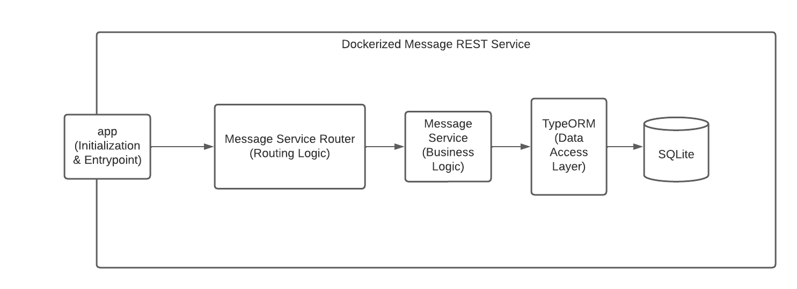
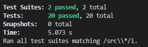

# Message Service

The message service is a RESTful microservice implemented to store and retrieve messages which may or may not be palindromes.

## Technology and Architecture

The message service is implemented in Typescript using the Node.js runtime. It leverages Express.js as the application framework and TypeORM + SQLite for persistence. The service is dockerized for deployment convenience and consistency.

The service follow a basic layered architecture which provides separation of concerns between app initialization, routing logic, business logic, data access and persistence.



## Running the Service

The dockerized service is available on Dockerhub! To run the service, simply run the container. Swagger documentation is provided at the root of the project!

```
docker run -p 8080:8080 marcgagnon/message-service:latest
```

You can also lint, build or run the project yourself. Ensure to install all necessary dependencies first:

```
npm install

npm run lint
npm run build
npm run serve
```

To run the tests, ensure the container is running and the .env values are correct or the end-to-end test will fail.

```
npm run test
```

